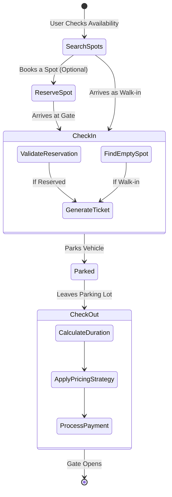
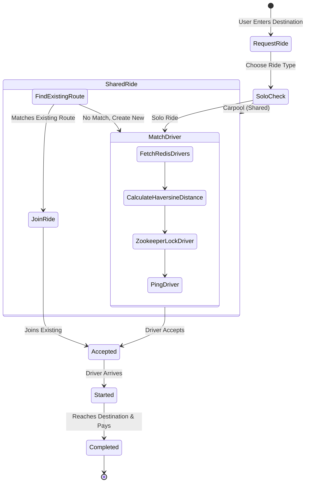

# 🚗 Park & Ride System
**Smart Parking & Last-Mile Connectivity Platform**  
*Team: Code Fusion*

---

## 📖 1. Introduction & Problem Statement

Urban cities face three major transportation problems:
1. **Traffic Congestion & Carbon Emissions:** The majority of cars on the road contain only one passenger. This under-utilization contributes to heavy traffic jams and increased carbon footprints.
2. **Unpredictable Parking Availability:** Drivers spend a significant amount of time circling blocks looking for parking, wasting fuel and causing severe frustration. 
3. **Last-Mile Connectivity Issues:** Public transit rarely takes passengers exactly to their doorstep. The gap between a transit hub (or a central parking lot) and the final destination is broken.

The **Park & Ride System** is a unified platform designed to solve these exact problems by integrating smart parking management with intelligent ride-sharing services. 

### How We Solve It
* **Predictable Parking:** Users can pre-book spaces or view real-time availability over APIs, terminating the guesswork of finding a spot.
* **Integrated Multi-Modal Transport:** A user can park their primary vehicle at a central hub and immediately summon a smart ride to their final "last-mile" destination, all from one unified system.
* **Shared Rides / Carpooling:** By mathematically matching riders taking similar routes and pooling them into the same car securely, we reduce the total number of vehicles on the road, directly combating congestion.

---

## ✨ 2. Key Features

### 🅿️ Smart Parking Management
* Real-time parking slot visibility.
* Pre-booking of parking spaces.
* Automated ticket generation with QR-code abstraction.
* Dynamic pricing based on vehicle type and duration.

### 🚖 Ride Sharing (Solo & Carpool)
* Booking of Solo Rides.
* Booking of Shared Carpool Rides (`rideType: 'shared'`).
* Real-time ride status lifecycle (`REQUESTED` → `ACCEPTED` → `STARTED` → `COMPLETED`).

### 🧠 Intelligent Matching & Constraints
* **Haversine Distance Algorithm**: Matches closest drivers utilizing geographic coordinate math.
* **Geo-Proximity Driver Search**: Allows bounding constraints (e.g., matching within 1.5km radius).
* **Distributed Locking (Zookeeper)**: Prevents the same driver from being double-booked by concurrent ride requests.
* **Capacity Validation**: Strictly ensures vehicle occupancy is never exceeded during carpools.

### 💳 Payment System
* Unified payment gateway supporting both parking tickets and passenger rides.
* Integrated with Razorpay for secure checkout logic.
* **Idempotent Transactions**: Prevents duplicate billing on network retries.

---

## 🔄 3. System Flow (Flowcharts)

### Parking System Flow


### Ride Sharing System Flow


---

## 🏗️ 4. System Architecture & Tech Stack

This system strictly follows a **Modular Layered Architecture** to guarantee separation of concerns, unit testability, and isolated scaling.

```text
[ Client (Mobile / Web) ]
        │
        ▼
[ API Gateway (Express Router) ]  --> Defines Routes
        │
        ▼
[ Controllers ]  --> Extracts Request Data, Issues HTTP Responses
        │
        ▼
[ Services ] --> Core Business & Orchestration Logic
        │
        ▼
[ Strategies ] --> Design Patterns (Fare Calculation / Pricing)
        │
        ▼
[ Models / DB Layer ] --> Data Objects, Redis Caching, DB Storage
```

### 🛠️ Technology Stack
| Technology | Purpose | Why We Chose This |
| :--- | :--- | :--- |
| **Node.js** | Backend Runtime | Non-blocking, event-driven architecture naturally scales for high I/O operations (concurrent ride requests, constant GPS updates). |
| **Express.js** | REST Framework | Minimalist routing suited for clean API endpoint creation. |
| **MongoDB** | Database | NoSQL document database perfect for storing adaptable schemas like `Ride` and `Ticket` entities. |
| **Redis** | In-Memory Cache | Extremely fast lookups. Used here to store and retrieve active, available drivers. |
| **Zookeeper** | Distributed Lock | Vital for preventing race conditions when two users hail the same nearby driver. |
| **Kafka** | Event Streaming | Handles high-throughput payload streams (like real-time moving coordinates). |
| **Razorpay** | Payment Gateway | Reliable 3rd party processor for local checkout logic. |

---

## 📂 5. Project Folder Structure

```text
src/
├── common/
│   └── utils/ (distanceCalculator.js, logger.js, errors.js)
├── parking/
│   ├── controllers/ (ParkingController.js)
│   ├── models/ (ParkingLot.js, ParkingSpot.js, Ticket.js, Vehicle.js, Reservation.js)
│   ├── routes/ (parkingRoutes.js)
│   ├── services/ (ParkingService.js)
│   └── strategies/ (PricingStrategy.js, PaymentStrategy.js)
├── ride/
│   ├── controllers/ (RideController.js, DriverController.js)
│   ├── models/ (Ride.js, Driver.js, RedisStore.js, PostgresStore.js, ZookeeperLock.js)
│   ├── routes/ (rideRoutes.js)
│   ├── services/ (RideService.js, DriverMatchingService.js, SharedRideMatcher.js)
│   └── strategies/ (FareCalculationStrategy.js)
└── payment/
    ├── controllers/ (paymentController.js)
    ├── models/ (Payment.js)
    └── routes/ (paymentRoutes.js)
```

*(Note: Modules are completely decoupled. The Parking module knows nothing about the Ride module, making microservice extraction trivial).*

---

## 🧩 6. Deep Dive: Parking System Design

The parking system actively manages the supply (Parking Spots) and demand (Vehicles). 

### 🔄 Step-By-Step Logic & Flow

#### 1. Checking Availability & Searching for Parking
Before heading to a parking lot or making a reservation, users can check for available spots. 
* **API Target:** `GET /api/spots/available`
* **Code Handling:** The system accesses the singleton `ParkingLot` to filter and return currently vacant spots.
```javascript
// src/parking/controllers/ParkingController.js
static getAvailableSpots(req, res) {
  // Accesses the in-memory array of Spot objects
  const spots = parkingService.getAvailableSpots();
  res.status(200).json({ count: spots.length, spots });
}
```

#### 2. Booking / Reserving a Parking Spot
Users provide their vehicle details and requested time window to secure a spot.
* **API Target:** `POST /api/reservations`
* **Edge Case Handled:** Ensures end time is after start time, and inherently blocks double-booking by allocating an exclusive `Reservation` object directly to a specific spot.
```javascript
// src/parking/services/ParkingService.js
createReservation(type, licensePlate, startTime, endTime) {
  if (new Date(startTime) >= new Date(endTime)) {
    throw new AppError(400, 'End time must be after start time');
  }
  // Finds a spot not overlapping with existing time windows
  const spot = this.parkingLot.getAvailableSpotForReservation(type, startTime, endTime);
  if (!spot) throw new AppError(400, 'No available spots for this time period');

  const reservation = new Reservation(type, licensePlate, startTime, endTime);
  spot.reserve(reservation); // Locks the spot for this time slot
  return reservation;
}
```

#### 3. Check-In (Generating a Ticket)
When a car arrives at the gate, we generate a formal ticket tracking their actual entry timestamp.
* **API Target:** `POST /api/checkin`
* **Logic:** Differentiates between a walk-in and a reserved vehicle. Validates license plate against the reservation.
* **Edge Case Handled:** Actively stops the *same physical car* from accidentally obtaining 2 active tickets inside the lot.
```javascript
// src/parking/services/ParkingService.js
checkIn(type, licensePlate, reservationId = null) {
  // Edge Case: Prevent double check-in mapping errors
  const existingTicket = Array.from(this.parkingLot.tickets.values())
    .find(t => t.vehicle.licensePlate === licensePlate && t.status === 'ACTIVE');
  if (existingTicket) throw new AppError(400, 'Vehicle is already parked inside');

  // Automatically allocates the correct physical spot context
  let spot = reservationId ? 
      this.handleReservedCheckIn(reservationId, licensePlate) :
      this.handleWalkInCheckIn(type); 
      
  const ticket = new Ticket(randomUUID(), vehicle, spot);
  return ticket;
}
```

#### 4. Check-Out & Payment Calculation
The user drives out. We freeze the chronological duration, delegate to a pricing configuration, process funds, and finally free the physical spot.
* **API Target:** `POST /api/checkout`
* **System Design Concept - Strategy Pattern:** By feeding the `checkOut` method abstracted Payment and Pricing strategies, we can change rate schemas (Daily vs Hourly) without altering the fundamental physics of vacating the spot.
```javascript
// src/parking/services/ParkingService.js
checkOut(ticketId, pricingStrategy, paymentStrategy) {
  const ticket = this.parkingLot.getTicket(ticketId);
  
  // Calculate Duration
  let durationInHours = Math.abs(new Date() - ticket.entryTime.getTime()) / 36e5;
  if (durationInHours < 1) durationInHours = 1;
  
  // Execute Strategy Patterns
  const fee = pricingStrategy.calculateFee(durationInHours, ticket.vehicle.type);
  const paymentSuccess = paymentStrategy.processPayment(fee);
  
  if (!paymentSuccess) throw new AppError(500, 'Payment failed');
  
  ticket.closeTicket(fee); // Vacates spot internally
  return ticket;
}
```

---

## 🚖 7. Deep Dive: Ride Sharing & Carpool System

This module is designed to connect drivers efficiently to passengers, supporting single trips and multi-passenger carpool routing.

### 🔄 Step-By-Step Logic & Flow

#### 1. Requesting a Ride & Matching Drivers
A user signals intent to travel from A to B. 
* **API Target:** `POST /v1/api/rides/request`
* **System Design Concept - In-Memory Caching (Redis) & Distributed Locking (Zookeeper):** Millions of GPS coordinates are pushed every minute. We cache active drivers in Redis for fast geospatial querying. However, two users might request a ride next to the exact same driver. We use Zookeeper locks to ensure one driver is an atomic entity, preventing double-bookings.
```javascript
// src/ride/services/DriverMatchingService.js
findNearbyDrivers(pickupLat, pickupLng, vehicleType) {
  // 1. Fetch available drivers rapidly from Redis Cache
  const availableDrivers = this.redisStore.getActiveDriversList();

  // 2. Sort by geographical proximity (Haversine Distance Algorithm)
  availableDrivers.sort((a, b) => a.distance - b.distance);

  const eligibleDrivers = [];
  for (const driver of availableDrivers) {
    // 3. ZOOKEEPER LOCK: Atomically secures driver so another thread doesn't steal them
    if (this.zookeeperLock.acquireLock(driver.driverId)) {
      eligibleDrivers.push(driver);
      if (eligibleDrivers.length >= 3) break; // Ping the top 3 closest drivers
    }
  }
  return eligibleDrivers;
}
```

#### 2. Evaluating & Joining a Shared Ride (Carpool)
If the user specifies `rideType: 'shared'`, the system optimizes by attempting to slot them into an existing vehicle moving the same way.
* **API Target:** `POST /v1/api/rides/join-shared`
* **Edge Case Handling (Capacity constraints):** Mathematically verifies that merging trajectories does not result in an unreasonable detour for existing passengers. Further ensures `availableSeats` never breaches maximum limits, preventing legal overcrowding.
```javascript
// src/ride/services/RideService.js
if (rideType === 'shared') {
  // Scans currently active rides for structural overlaps
  const existingRide = this.driverMatchingService.sharedRideMatcher
                           .findMatchingSharedRide(pickupLat, pickupLng, dropLat, dropLng);
  
  if (existingRide) {
    if (existingRide.currentRiders.find(r => r.userId === userId)) {
      throw new Error('Rider is already part of this ride'); // Edge Case Handling
    }
    // Mutates state and occupies a seat constraint safely
    existingRide.currentRiders.push({ userId, pickup: pickupLoc, drop: dropLoc });
    existingRide.availableSeats -= 1;
    return existingRide;
  }
}
```

#### 3. Ride Lifecycle Execution
After driver match, the real-world trip occurs. We enforce a strict finite state machine: `REQUESTED` → `ACCEPTED` → `STARTED` → `COMPLETED`.
* **API Targets:** `POST /v1/api/rides/accept`, `POST /v1/api/rides/start`
* **System Design Concept - Observer / Pub-Sub Pattern:** Notification hooks are triggered when state shifts so the passenger apps organically update their UI without excessive polling.
```javascript
// src/ride/services/RideService.js
acceptRide(rideId, driverId) {
  const ride = this.postgresStore.getRide(rideId);
  if (ride.status !== 'REQUESTED') throw new Error('Ride is no longer available'); // Enforce FSM state
  
  ride.status = 'ACCEPTED';
  
  // Releases the lock since the transaction logic succeeded
  this.driverMatchingService.releaseDriverLock(driverId);
  
  // Observer Pattern: Push update to passenger socket
  ride.currentRiders.forEach(r => {
      this.notificationService.notifyRider(r.userId, `Driver accepted your ride.`);
  });
  return ride;
}
```

---

## ⚙️ 8. Database Design (ER & Schemas)

By strictly defining the NoSQL structure, we pave the way for heavy geographical queries (`$nearSphere` in MongoDB).

### Database Collections (JSON Schemas)

**Ride Collection**
```javascript
{
  _id: ObjectId,
  driverId: ObjectId,            // Reference to Driver
  rideType: String,              // 'solo' | 'shared'
  status: String,                // 'REQUESTED' | 'ACCEPTED' | 'COMPLETED'
  currentRiders: [{
     userId: ObjectId,
     pickup: { lat, lng },
     drop: { lat, lng }
  }],
  availableSeats: Number
}
```

**Ticket Collection**
```javascript
{
  _id: ObjectId,
  vehicleId: ObjectId,
  spotId: ObjectId,
  entryTime: Date,
  exitTime: Date,
  fee: Number
}
```

### Entity Relationship
```text
[ User ] --(1:N)--> [ Vehicle ]
                       |
                   (1:N)
                       v
                 [ Ticket ] <--(1:1)--> [ Payment ]
                       ^                   |
                       |                 (1:1)
                 [ Parking Spot ]          v
                                        [ Ride ]
```

---

## 🎨 9. Design Patterns Used

Implementing strict Software Engineering Design patterns ensures stability:

1. **Factory Pattern (`VehicleFactory`)**: Creates exact instances of `Car`, `Bike`, or `Truck` ensuring centralized vehicle logic.
2. **Strategy Pattern (`PricingStrategy` & `FareCalculationStrategy`)**: Easily hot-swap pricing formulas based on surge hours, weekend rates, and vehicle tiers without modifying inner service constraints.
3. **Singleton Pattern (`PostgresStore`, `RedisStore`)**: Prevents memory leaks by ensuring the server instantiates exactly one DB connection pool to manage concurrent states.

---

## 🛡️ 10. Edge Case Handling (Why & How)

| Scenario | Handled By | Why it is handled this way |
| :--- | :--- | :--- |
| **Concurrency Collisions** | `ZookeeperLock.js` | Stops the system from assigning 1 driver to 2 discrete callers at the exact same millisecond. |
| **Carpool Overflow** | `availableSeats` attribute | Checks integer counts *before* accepting pushes into arrays. Protects drivers from being cited for overcrowding. |
| **Payment Dropoffs** | Unified Webhooks | If a user closes the Razorpay window but money leaves their bank, Razorpay's asynchronous webhook hits `/api/payment/webhook` to idempotently finalize the database record. |
| **No Parking Found** | Service Exceptions | Immediately kicks out a generic `400 Bad Request` rather than attempting a partial object generation, saving memory overhead. |

---

## 🌐 11. API Documentation Reference

*For full payloads, view Postman environments.*

### Parking APIs (`/api`)
* `POST /reservations` - Reserve a spot.
* `POST /checkin` - Entry validation.
* `POST /checkout` - Exit and compute fee.

### Ride APIs (`/v1/api`)
* `POST /rides/request` - Hail a driver.
* `POST /rides/join-shared` - Join passing carpool.
* `POST /ride/rides` - Driver interface for Accept/Deny.
* `POST /drivers/location` - High frequency pinging of GPS coordinates.

### Payment APIs (`/api/payment`)
* `POST /checkout` - Generate Razorpay processing Order ID.
* `POST /verify` - Confirms cryptographic signature matching.

---

## 🚀 12. Future Scope & Extensibility

If given further runway, the architecture supports:
1. **Real-time WebSockets (Socket.IO)**: Replacing polling mechanisms with active bi-directional streams for visualizing a car moving flawlessly across a mobile map.
2. **Advanced GIS Routing**: Connecting to Google Maps/MapBox to swap our current "Airline-style Haversine Distance" for exact traffic-adjusted ETAs.
3. **Database Migration to Real Shards**: Transitioning the JS `Maps` mocking system to actual `mongoose` schemas connected to a horizontally sharded Atlas cluster.
4. **Dockerization**: Writing a `docker-compose.yaml` to instantly boot Node, Redis, and Zookeeper locally.

---
*Built to scale. Designed for the modern commute.* 🏙️
