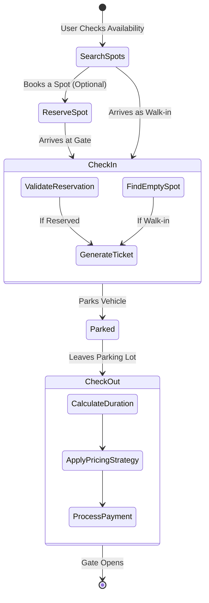
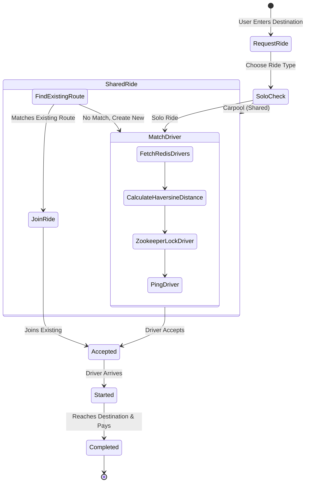
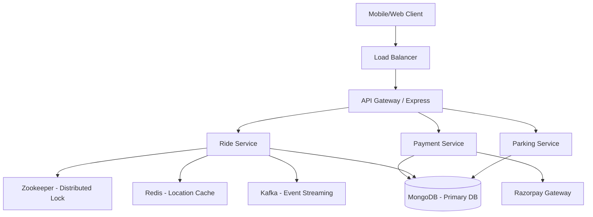
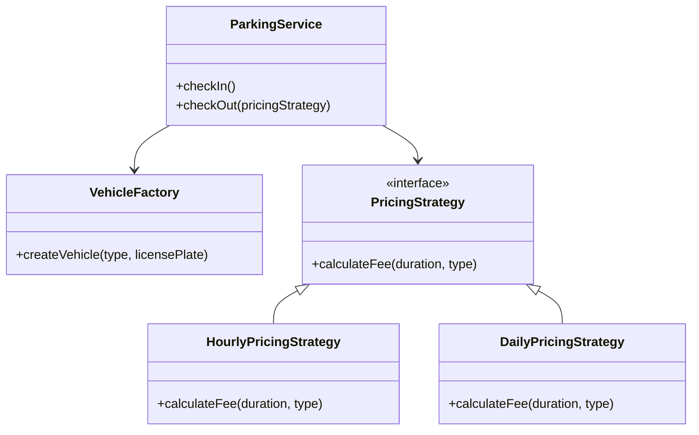

# 🚗 Park & Ride System - Architecture & System Design Document
**Smart Parking & Last-Mile Connectivity Platform**  
*Team: Code Fusion*

---

## 🎯 1. Introduction & Problem Statement

Urban cities face three major transportation problems:
1. **Traffic Congestion & Carbon Emissions:** Under-utilization of vehicles contributes to heavy traffic jams.
2. **Unpredictable Parking Availability:** Drivers waste fuel and time circling blocks looking for parking.
3. **Last-Mile Connectivity Issues:** The gap between a transit hub (or central parking) and the final destination is broken.

**Our Solution:** The Park & Ride System integrates smart parking management with intelligent ride-sharing. Users can pre-book parking predictably, and seamlessly transition into a mathematically routed shared carpool for their last mile, reducing congestion and unifying the transit experience.

---

## 🔄 2. System Flow Diagrams

### Parking Flow Diagram

**Backend Connection:** This flow represents the core Parking Finite State Machine. The system leverages an in-memory spot tracker during `SearchSpots`. `CheckIn` functions as a fork where the system validates existing DB reservations or provisions an active spot allocation. `CheckOut` acts as the termination node where Strategy patterns fire off calculation events before unlocking the spot for the next cycle.

### Ride Sharing Flow Diagram

**Backend Connection:** This flow manages the lifecycle of a driver assignment. It diverges immediately on ride type. If `SharedRide` is triggered, the system bypasses pinging isolated drivers if an overlap succeeds. The critical path is `MatchDriver`, where geospatial caching (Redis) hands over to cluster coordination (Zookeeper/Locks) to guarantee an atomic assignment before transitioning to `Accepted`.

---

## 🏗️ 3. High-Level Design (HLD)

### 3.1 System Architecture
The architecture is designed to support event-driven modules, ensuring modularity and scalability.



### 3.2 Why Modular Architecture?
By separating Parking, Ride, and Payment logic into distinct domains, the codebases remain decoupled. This allows scaling the `Ride Service` (which faces higher traffic due to location tracking queries) entirely independently from the `Parking Service`.

### 3.3 System Data Flow
- **Low-Latency Path (Redis):** Driver location updates are pushed directly to memory infrastructure.
- **Transactional Path (MongoDB):** Persistent states like ride completions, reservations, and ticket generation.
- **Consistency Path (Zookeeper):** Acquiring strict synchronization guarantees during driver assignment.

---

## 🧩 4. Low-Level Design (LLD)

### 4.1 Class Level Design
The application utilizes standard GOF design patterns to maintain stable and extensible logic.



---

## 🚘 5. Detailed Step-by-Step Implementation Logic

### 5.1 Detailed Step-by-Step Parking Flow
**1. User searches parking**
* **Explanation:** The user queries the application to view current slot availability.
* **Backend Logic:** Pings the data layer to aggregate slots mapped as `isOccupied == false`.
* **Snippet/Logic:** `return await Spot.countDocuments({ isOccupied: false });`
* **Edge Case:** *No available parking.* Immediately short-circuits the request and flags the UI, averting unnecessary transaction processing.

**2. User reserves spot**
* **Explanation:** The user selects a time block and initiates checkout for the reservation.
* **Backend Logic:** Places a brief transactional lock (`HOLD`) on the slot ID. If processing succeeds, the lock transitions into a persistent reservation record.
* **Snippet:** 
```javascript
const holdAcquired = await redis.set(`hold:${spotId}`, userId, 'NX', 'EX', 5); // 5 sec lock
if (!holdAcquired) throw new Error("Slot concurrently booked by another user");
```

**3. User check-in & 4. User parks vehicle**
* **Explanation:** The driver arrives at the physical gate.
* **Backend Logic:** Validates the reservation against the license plate. Generates a unique QR Code Ticket stamping exact `entryTime`. Marks the slot physical state to `Occupied`.
* **Edge Case:** *Double entry.* The arrays are parsed to verify the same license plate doesn't have an active session already open internally.

**5. User check-out & 6. Payment computation**
* **Explanation:** The car exits, the gate scans the ticket, and logic computes the cost.
* **Backend Logic:** Subtracts entry timestamp from current timestamp. Translates the duration through the delegated Strategy Pattern pricing formula.
* **Edge Case:** The user stayed past the reserved window. The formula seamlessly applies the designated overage multiplier dynamically.

### 5.2 Detailed Step-by-Step Ride Flow
**1. Ride request & 2. Driver Matching**
* **Explanation:** The user requests a trip. The system searches for the closest available driver.
* **Backend Logic:** Runs a radius bound (haversine query) across valid node coordinates and sorts sequentially by distance.
* **Snippet:** `const drivers = redis.geosearch('driver_locs', 'FROMLONLAT', lng, lat, 'BYRADIUS', 5, 'km');`

**3. Driver locking & 4. Ride acceptance**
* **Explanation:** Secures the driver so another concurrent request cannot assign them simultaneously.
* **Backend Logic:** Issues a lock on the target driver's ID. If granted, pushes the route data to the driver to Accept.
* **Edge Case:** *Driver collision.* Two concurrent pings occur. The atomic lock ensures only the fastest request succeeds; subsequent requests gracefully proceed to scan the next closest available driver.

**5. Ride start & 6. Ride completion**
* **Explanation:** The journey takes place.
* **Backend Logic:** At termination, payment executes, and the driver `status` reflects back to `IDLE`.

### 5.3 Shared Ride Flow (Carpooling Deep Dive)
**1. User selects shared ride & 2. System checks existing rides**
* **Explanation:** Combines trips to optimize load.
* **Backend Logic:** Queries for active rides matching `rideType: 'shared'` that bound the necessary target area.

**3. Route matching & 4. Capacity validation (Line Sweep)**
* **Explanation:** Validates the detour routing and ensures adding the user won't push the seat limit organically at any cross-section of the ongoing trip.
* **Backend Logic (Line Sweep algorithm):** Sorts pickup/drop-off nodes chronologically. As the sweep analyzes left-to-right, it tracks (+1 load, -1 load). If the tracker mathematically exceeds car capacity at any segment, the match fails safely.
* **Snippet:** 
```javascript
function isCapacityValid(trips, maxCapacity) {
    let currentPassengers = 0;
    for (const event of sortedTimelineEvents) {
        currentPassengers += event.value; 
        if (currentPassengers > maxCapacity) return false;
    }
    return true;
}
```

**5. Joining ride OR creating new ride**
* **Explanation:** If valid, the passenger is appended to the embedded array naturally. If the sweep or match fails, the system spins off a fresh solo driver request that handles the current user.

---

## 💻 6. Implementation Code Handlers (Core Functions)

### 6.1 Parking Core Functions
* `findAvailableSpot()`: Evaluates slots marked as `isOccupied: false` to return physical boundary data.
* `parkVehicle()`: Operates completely across the internal mapping logic to bind space constraints to a `Vehicle` entity.
* `checkIn()`: Core entry interaction API. Executes logic validating booking histories against hardware scans.
* `checkOut()`: Evaluator termination. Reverses `checkIn`, calls integrated pricing engines, frees tracking metrics, and finalizes the timeline.

### 6.2 Ride Core Functions
* `requestRide()`: Primary intake parser. Safely splits evaluation based on the requested `rideType`.
* `matchDriver()`: Dedicated handler managing geographic location scanning, calculations, and concurrent request locks.
* `joinSharedRide()`: Validation processor. Coordinates physical mapping tests via algorithms (Line Sweep) to determine if adding a rider mathematically voids capacity limits.

---

## 🚨 7. Edge Case Deep Dive
How the system manages complex workflows and exceptions natively:

* **No available parking:** Evaluated upfront safely, short-circuiting logic before committing DB resources.
* **Double booking / Concurrent reservation:** Resolved dynamically by leveraging transactional soft locks. The primary network request acquires the hold, explicitly preventing parallel user transactions on identical records.
* **Driver collision:** Handled physically over distributed locking. If application nodes request the exact same driver, the first thread holds the mutex securely.
* **Ride full:** Safely intercepted during the Line Sweep loop, ensuring the system never issues an assignment ticket if spatial constraints predict an overrun.
* **Payment failure:** Webhook architecture prevents indefinite hanging states. If an asynchronous `payment.failed` event is delivered, the module processes an automatic fallback clearing the ticket.

---

## 🗄️ 8. Database Schema Design (Deep Dive)

The system schema models pair embedded documents for localized access alongside relational referencing for isolated entities. 

### 8.1 MongoDB Schemas, Indexes & Patterns

**1. User Schema**
```json
{
  "_id": "ObjectId",
  "name": "String",
  "phone": "String",
  "walletBalance": "Number",
  "createdAt": "Date"
}
// Indexes: { "phone": 1 } (Unique - Fast lookups during authentication)
```

**2. Driver & Vehicle Schemas**
```json
{
  "_id": "ObjectId",
  "currentLocation": { "type": "Point", "coordinates": [lng, lat] }, 
  "status": "String (ACTIVE | IDLE | OFFLINE)",
  "vehicleId": "ObjectId (Ref: Vehicle)"
}
// Indexes: { "currentLocation": "2dsphere" } (Critical for geographic distance querying)
```
* **Separation Logic:** A driver might operate different physical vehicles on varying shifts. Keeping them independent ensures structural flexibility.

**3. ParkingSpot & Reservation Schemas**
```json
{
  "_id": "ObjectId",
  "spotNumber": "String",
  "isOccupied": "Boolean",
  "reservations": [{ 
      "bookingId": "ObjectId",
      "userId": "ObjectId",
      "startTime": "Date",
      "endTime": "Date"
  }]
}
// Indexes: { "isOccupied": 1 }
```
* **Embedding vs Referencing Trade-off:** Reservations are safely embedded into the primary `ParkingSpot` array. Operating locally on the parent spot prevents race conditions natively.

**4. Ride Collection**
```json
{
  "_id": "ObjectId",
  "driverId": "ObjectId", 
  "rideType": "String (solo | shared)",
  "currentRiders": [{ 
     "userId": "ObjectId",
     "pickup": { "lat": 12.3, "lng": 45.6 },
     "drop": { "lat": 44.4, "lng": 11.2 }
  }],
  "maxCapacity": 4,
  "status": "String (STARTED | COMPLETED)"
}
// Indexes: { "status": 1, "rideType": 1 }
```
* **Embedding over Referencing:** Embedding `currentRiders` avoids repeated query lookups. Viewing a single ride document instantly yields passenger data.

**5. Ticket & Payment Schemas**
```json
{
  "_id": "ObjectId", // Functions logically as the scanning Token
  "spotId": "ObjectId",
  "entryTime": "Date",
  "exitTime": "Date",
  "fee": "Number",
  "transactionId": "String" // Idempotency logic enforcement
}
```

### 8.2 ER Diagram (Entity Relationships)
```text
[ User ] ---(1:N)---> [ Vehicle ]
                       | (1:N)
                       v
                 [ Ticket ] <---(1:1)---> [ Payment ]
                       ^                    |
                 (N:1) |                    | (1:1)
                 [ Parking Spot ]           v
                                         [ Ride ] <---(1:N)--- [ Driver ]
```

---

## 🔌 9. API Deep Dive

### A. Book Ride (POST `/v1/api/rides/request`)
**Request JSON:**
```json
{
  "userId": "60d5ecb8b392d7",
  "pickup": { "lat": 12.9716, "lng": 77.5946 },
  "drop": { "lat": 12.9515, "lng": 77.4986 },
  "rideType": "shared",
  "vehicleType": "CAR"
}
```
**Response JSON (200 OK):**
```json
{ 
  "message": "Matched and joined existing shared ride", 
  "rideId": "77f9cd", 
  "driverEta": "4 mins" 
}
```
**Validation Logic:** Verifies coordinates and payload constraints.

### B. Parking Checkout (POST `/api/parking/checkout`)
**Request JSON:**
```json
{
  "ticketId": "qr_abc123",
  "pricingMethod": "HOURLY"
}
```
**Validation Logic:** Extracts precise duration from `entryTime`, confirming against `exitTime` logic paths safely and injecting algorithms.

---

## ⚖️ 10. Design Decisions

1. **Why Node.js?**
   * Node.js operates on an event-driven architecture that functions superbly for highly active IO bounds, managing frequent WebSocket connections and parallel request events securely.
2. **Why MongoDB?**
   * Unstructured document flexibility complements variable-sized structures like `currentRiders` dynamically, while natively handling GeoJSON `$nearSphere` location queries perfectly.
3. **Why Redis?**
   * Updating continuous GPS tracking streams into a hard disk would severely bottleneck persistence data layers. Redis structures temporary state tracking tightly in system memory.
4. **Why Distributed Locks (Zookeeper)?**
   * To handle atomic assignment. While solutions heavily emphasize availability, coordination systems like Zookeeper place strict guarantees on maintaining Consistency, effectively mitigating race conditions over identical drivers.

---

## 🚀 11. Future Scalability & Enhancements

While the basic configurations demonstrate core backend logic operations, the overarching structure incorporates mechanisms built for robust scaling:

* **Horizontal Scaling**: The API configurations efficiently support scaling Node instances alongside load balancing clusters (such as NGINX or ALB) gracefully securely.
* **Database Migration & Sharding**: As physical ride history scales continuously, MongoDB enables explicit partitioning models. Hashing the `userId` provides a strong strategy to partition historical data dynamically uniformly.
* **Caching Subsystems**: Pricing layers and static boundaries integrate easily inside Redis architectures to shield standard disk operations from exhaustive reads.
* **Real-time WebSockets**: Replacing client polling endpoints strictly with Socket.IO streams enables efficient, persistent bi-directional communication channels supporting live tracking reliably.

---

## 🛡️ 12. Failure Handling & Resilience

* **Payment Validations:** Integrated safely over webhook processes that verify dropped user transactions asynchronously.
* **Spot Commitments:** Validated efficiently against Redis `Hold` limits maintaining unhindered checkout states.
* **Driver Connections:** Checked reliably against timeout loops removing unavailable drivers cleanly ensuring valid passenger pairings dynamically.

---

## ⚠️ 13. Current Limitations

This current project documentation operates as a strong demonstration of software patterns; it is aware of standard functional limitations intrinsically:

* **In-Memory Logic:** Aspects surrounding active session limits rely temporarily on locally modeled arrays to demonstrate logic seamlessly.
* **Simulated Geographical Tracking:** The current Haversine model computes "as-the-crow-flies" distance statically rather than consuming complex external mapping APIs representing active traffic networks securely.
* **Infrastructure Deployment:** Components (Kafka/Redis/Zookeeper/MongoDB) highlight architectural models logically; active demonstrations resolve entirely inside contained local container networking limits presently safely.
* **Active Hardware Monitoring:** Lacks fully realized live continuous bi-directional tracking implementations tracking pure live device GPS modules continuously safely.

---

## 🔄 14. System Trade-Offs

* **Accuracy vs Performance:** Implementing pure Haversine distance computations functions tremendously quickly (O(1)) sequentially but does not factor standard real-world traffic flows. A calculated technical trade-off providing instantaneous computational bounds securely locally.
* **Consistency vs Latency:** Using explicit node locks across assignments guarantees consistency inherently but generates small intrinsic delays safely processing atomic locks.
* **Embedding vs Referencing:** Storing embedded target data safely inside the array eliminates explicit mapping delays, successfully managing N+1 query limits logically over data redundancy.
