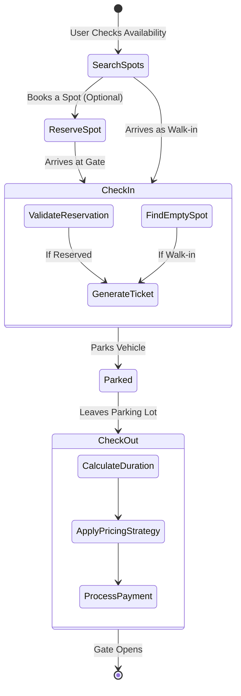
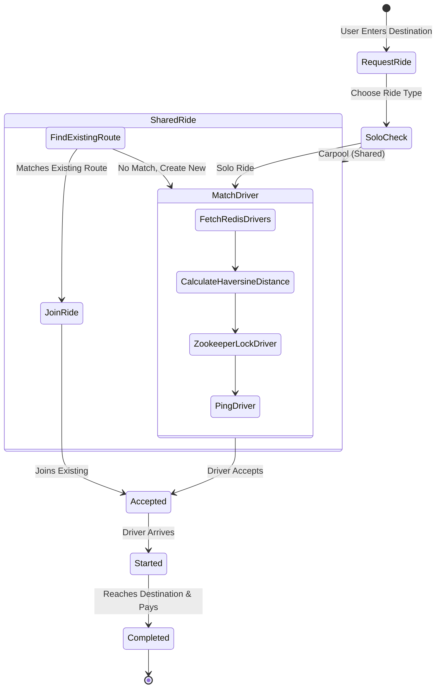
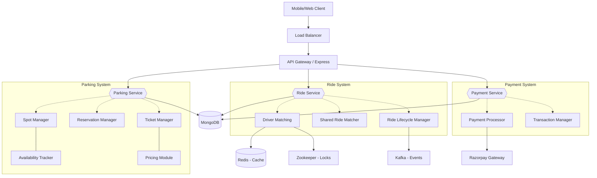
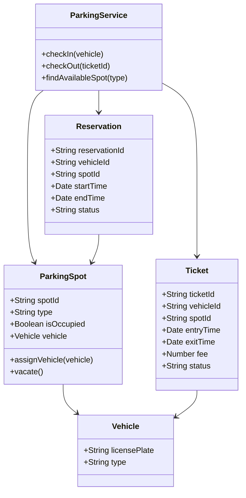
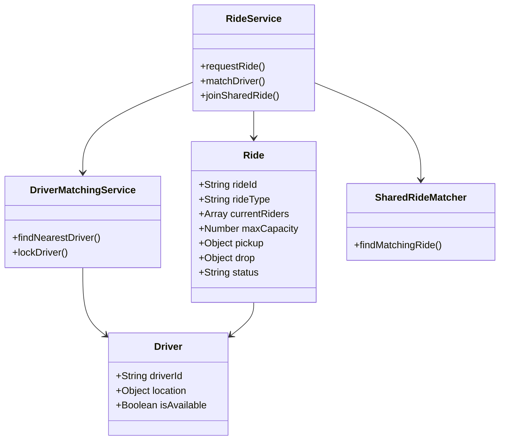

# 🚗 Park & Ride System - Architecture & System Design Document
**Smart Parking & Last-Mile Connectivity Platform**  
*Team: Code Fusion*

---

## 🎯 1. Introduction & Problem Statement

Urban cities face three major transportation problems:
1. **Traffic Congestion & Carbon Emissions:** Under-utilization of vehicles contributes to heavy traffic jams.
2. **Unpredictable Parking Availability:** Drivers waste fuel and time circling blocks looking for parking.
3. **Last-Mile Connectivity Issues:** The gap between a transit hub (or central parking) and the final destination is broken.

**Our Solution:** The Park & Ride System integrates smart parking management with intelligent ride-sharing. Users can pre-book parking predictably, and seamlessly transition into a mathematically routed shared carpool for their last mile, reducing congestion and unifying the transit experience.

---

## 🔄 2. System Flow Diagrams

### Parking Flow Diagram

**Backend Connection:** This flow represents the core Parking Finite State Machine. The system leverages an in-memory spot tracker during `SearchSpots`. `CheckIn` functions as a fork where the system validates existing DB reservations or provisions an active spot allocation. `CheckOut` acts as the termination node where Strategy patterns fire off calculation events before unlocking the spot for the next cycle.

### Ride Sharing Flow Diagram

**Backend Connection:** This flow manages the lifecycle of a driver assignment. It diverges immediately on ride type. If `SharedRide` is triggered, the system bypasses pinging isolated drivers if an overlap succeeds. The critical path is `MatchDriver`, where geospatial caching (Redis) hands over to cluster coordination (Zookeeper/Locks) to guarantee an atomic assignment before transitioning to `Accepted`.

---

## 🏗️ 3. High-Level Design (HLD)

### 3.1 System Architecture
The architecture is designed to support event-driven modules, ensuring modularity and scalability. Below is the detailed High-Level Design (HLD) breaking down the system into localized logical components.



**Component Explanations:**
* **API Gateway & Entry Layer:** The Load Balancer and API Gateway handle initial routing and request validation, securely passing traffic to the appropriate stateless core services.
* **Parking Service:** Contains the **Spot Manager** and **Availability Tracker** (for finding and allocating spots), the **Reservation Manager** (for ahead-of-time bookings), and the **Ticket Manager** and **Pricing Module** (for entry/exit flow handling and fee calculations).
* **Ride Service:** The core ride system. Features **Driver Matching** (connecting isolated rides), **Shared Ride Matcher** (route-based carpool joining), and a **Ride Lifecycle Manager** (managing states like STARTED/COMPLETED). It interacts with Redis (fast driver location caching), Zookeeper (prevents driver double-booking conflicts), and Kafka (handles system-wide event updates asynchronously).
* **Payment Service:** Dedicated pipeline where the **Transaction Manager** controls data consistency and prevents partial payments, while the **Payment Processor** directly integrates with external gateways like Razorpay for final execution.
* **Database Layer:** **MongoDB** functions as the primary operational database. All architectural services safely interact directly with MongoDB to fetch or store data, maintaining state persistence independently.

### 3.2 Why Modular Architecture?
By separating Parking, Ride, and Payment logic into distinct domains, the codebases remain decoupled. This allows scaling the `Ride Service` (which faces higher traffic due to location tracking queries) entirely independently from the `Parking Service`.

### 3.3 System Data Flow
- **Low-Latency Path (Redis):** Driver location updates are pushed directly to memory infrastructure.
- **Transactional Path (MongoDB):** Persistent states like ride completions, reservations, and ticket generation.
- **Consistency Path (Zookeeper):** Acquiring strict synchronization guarantees during driver assignment.

---

## 🧩 4. Low-Level Design (LLD)

### 4.1 Parking System Class Design
This class diagram illustrates the primary entities and logic flow for the Parking module.



**Class Explanations:**
* **Vehicle:** Represents a user's car navigating the parking ecosystem.
* **ParkingSpot:** Represents the physical space, managing its own occupancy state and vehicle assignment.
* **Reservation:** Stores pre-booked time windows for a specific spot and vehicle context.
* **Ticket:** Tracks an active session, capturing duration and the financial fee upon exit.
* **ParkingService:** The core orchestrator managing spot allocation, check-ins, and checkout logistics.

**Parking Flow:**  
The exact lifecycle: `checkIn` initialized → `findAvailableSpot` allocates a spot → `assignVehicle` locks the space → `Ticket` generated to log entry → User returns and triggers `checkOut` → Duration fee calculated → Space officially reaches `vacate`.

---

### 4.2 Ride System Class Design
This class diagram focuses on the Ride module, detailing both solo matchings and shared ride aggregations.



**Class Explanations:**
* **Ride:** Represents a logical trip entity, holding passenger arrays, capacities, and route coordinates.
* **Driver:** Maintains driver identity, live geospatial tracking, and job availability status.
* **RideService:** Application orchestrator managing high-level requests, deciding between solo or carpool routing.
* **DriverMatchingService:** Core assignment engine finding candidates geospatially and safely locking them (`lockDriver`).
* **SharedRideMatcher:** Evaluates overlapping active journeys to pair optimal carpool riders dynamically.

**Ride Flow:**  
The exact lifecycle: User makes `request` → System delegates to `DriverMatchingService` or `SharedRideMatcher` for a `match` → `Driver` confirms and moves to `accept` → Ride formally switches to `start` status → Destination is reached, marking the log as `complete`.

---

## 🚘 5. Deep Dive: Parking System Design

The parking system actively manages real-time spot reservations and validation bridging.

### 🔄 Step-By-Step Logic & Flow

#### 1. Checking Availability & Searching for Parking
Before heading to a parking lot or making a reservation, users can check for available spots. 
* **API Target:** `GET /api/spots/available`
* **Code Handling:** The system accesses the singleton `ParkingLot` to filter and return currently vacant spots.
```javascript
// src/parking/controllers/ParkingController.js
static getAvailableSpots(req, res) {
  // Accesses the in-memory array of Spot objects
  const spots = parkingService.getAvailableSpots();
  res.status(200).json({ count: spots.length, spots });
}
```

#### 2. Booking / Reserving a Parking Spot
Users provide their vehicle details and requested time window to secure a spot.
* **API Target:** `POST /api/reservations`
* **System Design Concept - Concurrent Booking Locks:** When two users attempt to book the exact same slot concurrently, the system briefly locks the resource using a temporary `HOLD` until checkout completes, averting race conditions.
* **Edge Case Handled:** Ensures end time is after start time, and inherently blocks double-booking.
```javascript
// src/parking/services/ParkingService.js
createReservation(type, licensePlate, startTime, endTime) {
  if (new Date(startTime) >= new Date(endTime)) throw new AppError(400, 'End time must be after start time');

  // 1. Scan dynamically to prevent overlaps
  const availableSlots = this.parkingLot.getAvailableSpotForReservation(type, startTime, endTime);
  if (!availableSlots) throw new AppError(400, 'No available spots for this time period');

  // 2. Transaction safety (avoid double booking concurrently)
  const holdAcquired = this.parkingLot.createHold(availableSlots.id, licensePlate, 5000); // 5 sec hold
  if (!holdAcquired) throw new AppError(409, 'Slot is currently being booked by another user');

  const reservation = new Reservation(type, licensePlate, startTime, endTime);
  availableSlots.reserve(reservation); // Validates into final DB lock
  return reservation;
}
```

#### 3. Check-In (Generating a Ticket)
When a car arrives at the gate, we generate a formal ticket tracking their actual entry timestamp.
* **API Target:** `POST /api/checkin`
* **Logic:** Differentiates between a walk-in and a reserved vehicle. Validates license plate against the reservation.
* **Edge Case Handled:** Actively stops the *same physical car* from accidentally obtaining 2 active tickets inside the lot.
```javascript
// src/parking/services/ParkingService.js
checkIn(type, licensePlate, reservationId = null) {
  // Edge Case: Prevent double check-in mapping errors
  const existingTicket = Array.from(this.parkingLot.tickets.values())
    .find(t => t.vehicle.licensePlate === licensePlate && t.status === 'ACTIVE');
  if (existingTicket) throw new AppError(400, 'Vehicle is already parked inside');

  // Automatically allocates the correct physical spot context
  let spot = reservationId ? 
      this.handleReservedCheckIn(reservationId, licensePlate) :
      this.handleWalkInCheckIn(type); 
      
  const ticket = new Ticket(randomUUID(), vehicle, spot);
  return ticket;
}
```

#### 4. Check-Out & Payment Calculation
The user drives out. We freeze the chronological duration, delegate to a pricing configuration, process funds, and finally free the physical spot.
* **API Target:** `POST /api/checkout`
* **System Design Concept - Strategy Pattern:** By feeding the `checkOut` method abstracted Payment and Pricing strategies, we can change rate schemas (Daily vs Hourly) without altering the fundamental physics of vacating the spot.
```javascript
// src/parking/services/ParkingService.js
checkOut(ticketId, pricingStrategy, paymentStrategy) {
  const ticket = this.parkingLot.getTicket(ticketId);
  
  // Calculate Duration
  let durationInHours = Math.abs(new Date() - ticket.entryTime.getTime()) / 36e5;
  if (durationInHours < 1) durationInHours = 1;
  
  // Execute Strategy Patterns
  const fee = pricingStrategy.calculateFee(durationInHours, ticket.vehicle.type);
  const paymentSuccess = paymentStrategy.processPayment(fee);
  
  if (!paymentSuccess) throw new AppError(500, 'Payment failed');
  
  ticket.closeTicket(fee); // Vacates spot internally
  return ticket;
}
```

---

## 🚖 6. Deep Dive: Ride Sharing & Carpool System

This module is designed to connect drivers efficiently to passengers, supporting single trips and multi-passenger carpool routing.

### 🔄 Step-By-Step Logic & Flow

#### 1. Requesting a Ride & Matching Drivers
A user signals intent to travel from A to B. 
* **API Target:** `POST /v1/api/rides/request`
* **System Design Concept - In-Memory Caching (Redis) & Distributed Locking (Zookeeper):** Millions of GPS coordinates are pushed every minute. We cache active drivers in Redis for fast geospatial querying. However, two users might request a ride next to the exact same driver. We use Zookeeper locks to ensure one driver is an atomic entity, preventing double-bookings.
```javascript
// src/ride/services/DriverMatchingService.js
findNearbyDrivers(pickupLat, pickupLng, vehicleType) {
  // 1. Fetch available drivers rapidly from Redis Cache
  const availableDrivers = this.redisStore.getActiveDriversList();

  // 2. Sort by geographical proximity (Haversine Distance Algorithm)
  availableDrivers.sort((a, b) => a.distance - b.distance);

  const eligibleDrivers = [];
  for (const driver of availableDrivers) {
    // 3. ZOOKEEPER LOCK: Atomically secures driver so another thread doesn't steal them
    if (this.zookeeperLock.acquireLock(driver.driverId)) {
      eligibleDrivers.push(driver);
      if (eligibleDrivers.length >= 3) break; // Ping the top 3 closest drivers
    }
  }
  return eligibleDrivers;
}
```

#### 2. Evaluating & Joining a Shared Ride (Carpool)
If the user specifies `rideType: 'shared'`, the system optimizes by attempting to slot them into an existing vehicle moving the same way using trajectory validations.
* **API Target:** `POST /v1/api/rides/join-shared`
* **System Design Concept - Capacity Checking (Line Sweep Technique):** To dynamically guarantee that overlapping trajectories don't exceed the physical capacity of the car at *any* intermediate point, we employ a line-sweep algorithm to validate events chronologically before adding the user.
```javascript
// src/ride/services/RideService.js
if (rideType === 'shared') {
  // Scans for structural route overlaps that do not add massive detours
  const existingRide = this.driverMatchingService.sharedRideMatcher
                           .findMatchingSharedRide(pickupLat, pickupLng, dropLat, dropLng);
  
  if (existingRide) {
    if (existingRide.currentRiders.find(r => r.userId === userId)) throw new Error('Rider is already part of this ride');
    
    // Internal Capacity Check dynamically mapping overlaps
    let currentPassengers = 0;
    for (const event of this.buildTimelineEvents(existingRide.currentRiders, newPassenger)) {
       currentPassengers += event.value; // +1 entering, -1 exiting
       if (currentPassengers > existingRide.maxCapacity) {
           throw new Error('Capacity violated at cross-section! Finding new ride.'); 
       }
    }

    // Mutates state safely
    existingRide.currentRiders.push({ userId, pickup: pickupLoc, drop: dropLoc });
    return existingRide;
  }
  // Fallback: Dispatch an entirely new car pooling session
  return createRide(userId, ...);
}
```

#### 3. Ride Lifecycle Execution
After driver match, the real-world trip occurs. We enforce a strict finite state machine: `REQUESTED` → `ACCEPTED` → `STARTED` → `COMPLETED`.
* **API Targets:** `POST /v1/api/rides/accept`, `POST /v1/api/rides/start`
* **System Design Concept - Observer / Pub-Sub Pattern:** Notification hooks are triggered when state shifts so the passenger apps organically update their UI without excessive polling.
```javascript
// src/ride/services/RideService.js
acceptRide(rideId, driverId) {
  const ride = this.postgresStore.getRide(rideId);
  if (ride.status !== 'REQUESTED') throw new Error('Ride is no longer available'); // Enforce FSM state
  
  ride.status = 'ACCEPTED';
  
  // Releases the lock since the transaction logic succeeded
  this.driverMatchingService.releaseDriverLock(driverId);
  
  // Observer Pattern: Push update to passenger socket
  ride.currentRiders.forEach(r => {
      this.notificationService.notifyRider(r.userId, `Driver accepted your ride.`);
  });
  return ride;
}
```

---

## 🛡️ 7. Edge Case Handling (Why & How)

| Scenario | Handled By | Why it is handled this way |
| :--- | :--- | :--- |
| **Concurrency Collisions** | `ZookeeperLock.js` | Stops the system from assigning 1 driver to 2 discrete callers at the exact same millisecond. |
| **Carpool Overflow** | `availableSeats` attribute | Checks integer counts *before* accepting pushes into arrays. Protects drivers from being cited for overcrowding. |
| **Payment Dropoffs** | Unified Webhooks | If a user closes the Razorpay window but money leaves their bank, Razorpay's asynchronous webhook hits `/api/payment/webhook` to idempotently finalize the database record. |
| **No Parking Found** | Service Exceptions | Immediately kicks out a generic `400 Bad Request` rather than attempting a partial object generation, saving memory overhead. |

---

## 🗄️ 8. Database Schema Design (Deep Dive)

The system schema models pair embedded documents for localized access alongside relational referencing for isolated entities. 

### 8.1 MongoDB Schemas, Indexes & Patterns

**1. User Schema**
```json
{
  "_id": "ObjectId",
  "name": "String",
  "phone": "String",
  "walletBalance": "Number",
  "createdAt": "Date"
}
// Indexes: { "phone": 1 } (Unique - Fast lookups during authentication)
```

**2. Driver & Vehicle Schemas**
```json
{
  "_id": "ObjectId",
  "currentLocation": { "type": "Point", "coordinates": [lng, lat] }, 
  "status": "String (ACTIVE | IDLE | OFFLINE)",
  "vehicleId": "ObjectId (Ref: Vehicle)"
}
// Indexes: { "currentLocation": "2dsphere" } (Critical for geographic distance querying)
```
* **Separation Logic:** A driver might operate different physical vehicles on varying shifts. Keeping them independent ensures structural flexibility.

**3. ParkingSpot & Reservation Schemas**
```json
{
  "_id": "ObjectId",
  "spotNumber": "String",
  "isOccupied": "Boolean",
  "reservations": [{ 
      "bookingId": "ObjectId",
      "userId": "ObjectId",
      "startTime": "Date",
      "endTime": "Date"
  }]
}
// Indexes: { "isOccupied": 1 }
```
* **Embedding vs Referencing Trade-off:** Reservations are safely embedded into the primary `ParkingSpot` array. Operating locally on the parent spot prevents race conditions natively.

**4. Ride Collection**
```json
{
  "_id": "ObjectId",
  "driverId": "ObjectId", 
  "rideType": "String (solo | shared)",
  "currentRiders": [{ 
     "userId": "ObjectId",
     "pickup": { "lat": 12.3, "lng": 45.6 },
     "drop": { "lat": 44.4, "lng": 11.2 }
  }],
  "maxCapacity": 4,
  "status": "String (STARTED | COMPLETED)"
}
// Indexes: { "status": 1, "rideType": 1 }
```
* **Embedding over Referencing:** Embedding `currentRiders` avoids repeated query lookups. Viewing a single ride document instantly yields passenger data.

**5. Ticket & Payment Schemas**
```json
{
  "_id": "ObjectId", // Functions logically as the scanning Token
  "spotId": "ObjectId",
  "entryTime": "Date",
  "exitTime": "Date",
  "fee": "Number",
  "transactionId": "String" // Idempotency logic enforcement
}
```

### 8.2 ER Diagram (Entity Relationships)
```text
[ User ] ---(1:N)---> [ Vehicle ]
                       | (1:N)
                       v
                 [ Ticket ] <---(1:1)---> [ Payment ]
                       ^                    |
                 (N:1) |                    | (1:1)
                 [ Parking Spot ]           v
                                         [ Ride ] <---(1:N)--- [ Driver ]
```

---

## 🔌 9. API Deep Dive

### A. Book Ride (POST `/v1/api/rides/request`)
**Request JSON:**
```json
{
  "userId": "60d5ecb8b392d7",
  "pickup": { "lat": 12.9716, "lng": 77.5946 },
  "drop": { "lat": 12.9515, "lng": 77.4986 },
  "rideType": "shared",
  "vehicleType": "CAR"
}
```
**Response JSON (200 OK):**
```json
{ 
  "message": "Matched and joined existing shared ride", 
  "rideId": "77f9cd", 
  "driverEta": "4 mins" 
}
```
**Validation Logic:** Verifies coordinates and payload constraints.

### B. Parking Checkout (POST `/api/parking/checkout`)
**Request JSON:**
```json
{
  "ticketId": "qr_abc123",
  "pricingMethod": "HOURLY"
}
```
**Validation Logic:** Extracts precise duration from `entryTime`, confirming against `exitTime` logic paths safely and injecting algorithms.

---

## ⚖️ 10. Design Decisions

1. **Why Node.js?**
   * Node.js operates on an event-driven architecture that functions superbly for highly active IO bounds, managing frequent WebSocket connections and parallel request events securely.
2. **Why MongoDB?**
   * Unstructured document flexibility complements variable-sized structures like `currentRiders` dynamically, while natively handling GeoJSON `$nearSphere` location queries perfectly.
3. **Why Redis?**
   * Updating continuous GPS tracking streams into a hard disk would severely bottleneck persistence data layers. Redis structures temporary state tracking tightly in system memory.
4. **Why Distributed Locks (Zookeeper)?**
   * To handle atomic assignment. While solutions heavily emphasize availability, coordination systems like Zookeeper place strict guarantees on maintaining Consistency, effectively mitigating race conditions over identical drivers.

---

## 🚀 11. Future Scalability & Enhancements

While the basic configurations demonstrate core backend logic operations, the overarching structure incorporates mechanisms built for robust scaling:

* **Horizontal Scaling**: The API configurations efficiently support scaling Node instances alongside load balancing clusters (such as NGINX or ALB) gracefully securely.
* **Database Migration & Sharding**: As physical ride history scales continuously, MongoDB enables explicit partitioning models. Hashing the `userId` provides a strong strategy to partition historical data dynamically uniformly.
* **Caching Subsystems**: Pricing layers and static boundaries integrate easily inside Redis architectures to shield standard disk operations from exhaustive reads.
* **Real-time WebSockets**: Replacing client polling endpoints strictly with Socket.IO streams enables efficient, persistent bi-directional communication channels supporting live tracking reliably.

---

## 🛡️ 12. Failure Handling & Resilience

* **Payment Validations:** Integrated safely over webhook processes that verify dropped user transactions asynchronously.
* **Spot Commitments:** Validated efficiently against Redis `Hold` limits maintaining unhindered checkout states.
* **Driver Connections:** Checked reliably against timeout loops removing unavailable drivers cleanly ensuring valid passenger pairings dynamically.

---

## ⚠️ 13. Current Limitations

This current project documentation operates as a strong demonstration of software patterns; it is aware of standard functional limitations intrinsically:

* **In-Memory Logic:** Aspects surrounding active session limits rely temporarily on locally modeled arrays to demonstrate logic seamlessly.
* **Simulated Geographical Tracking:** The current Haversine model computes "as-the-crow-flies" distance statically rather than consuming complex external mapping APIs representing active traffic networks securely.
* **Infrastructure Deployment:** Components (Kafka/Redis/Zookeeper/MongoDB) highlight architectural models logically; active demonstrations resolve entirely inside contained local container networking limits presently safely.
* **Active Hardware Monitoring:** Lacks fully realized live continuous bi-directional tracking implementations tracking pure live device GPS modules continuously safely.

---

## 🔄 14. System Trade-Offs

* **Accuracy vs Performance:** Implementing pure Haversine distance computations functions tremendously quickly (O(1)) sequentially but does not factor standard real-world traffic flows. A calculated technical trade-off providing instantaneous computational bounds securely locally.
* **Consistency vs Latency:** Using explicit node locks across assignments guarantees consistency inherently but generates small intrinsic delays safely processing atomic locks.
* **Embedding vs Referencing:** Storing embedded target data safely inside the array eliminates explicit mapping delays, successfully managing N+1 query limits logically over data redundancy.
